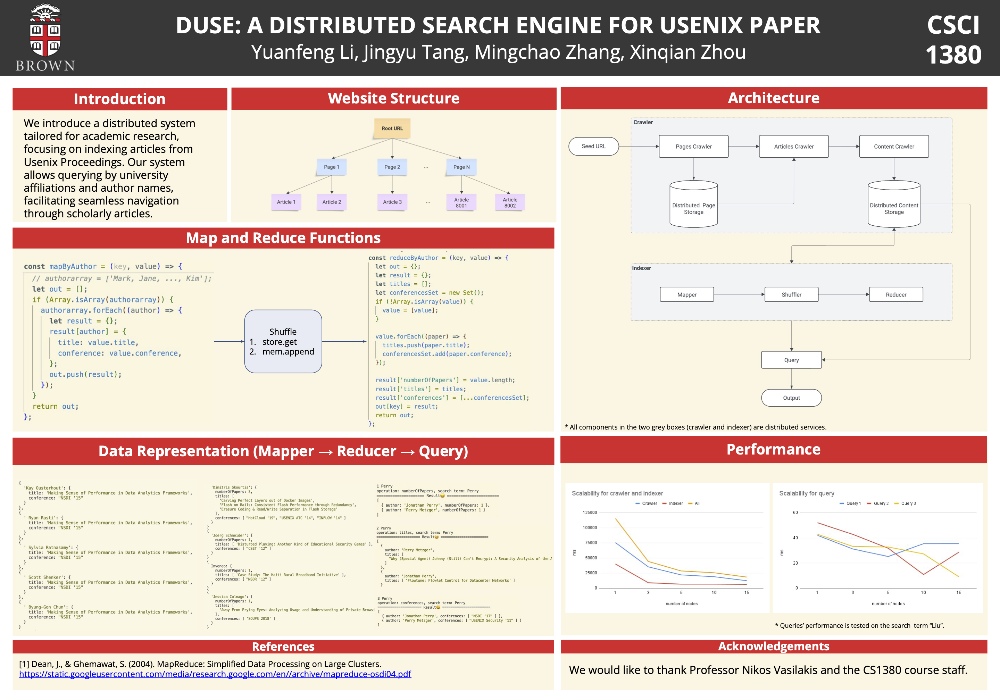

# DUSE: A DISTRIBUTED SEARCH ENGINE FOR USENIX PAPER

This is the final project for CSCI-1380 Distributed System, Spring 2024, Brown.



## Conrtributors

- Yuanfeng Li
- Jingyu Tang
- Mingchao Zhang
- Xinqian Zhou

## How to use

### Local

1. Start the engine:

```shell
npm install
node engine/App.js
```

2. Start the frontend:

```shell
cd frontend
npm install
npm run start
# the web server will be localhost:3000
```

### Deployed

[Web Server](https://aigaoshiboy.github.io/csci1380-m6/)
