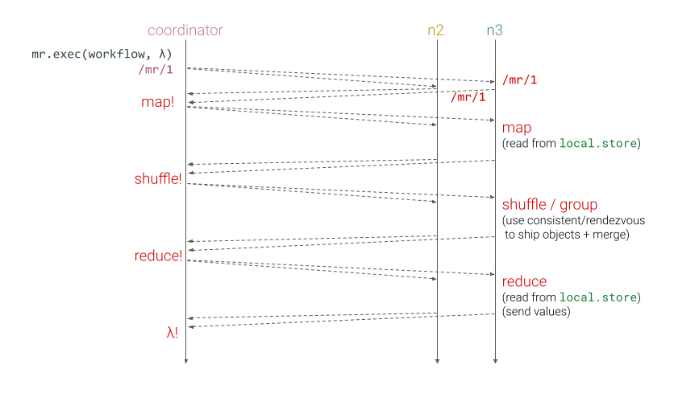

# M5: Distributed Execution Engine

> Collaboration: Individual milestone 
> Completion: About 12–16 hours 
> Deadline: Tuesday Apr. 9, 2024 (11:59PM ET) 
> Latest handout version: CS1380:2024:M5 
> GitHub repo: https\://github.com/brown-cs1380/m5

The goal of this milestone is to implement a scalable programming model and abstractions for processing large data sets in a distributed fashion.The core of the execution engine combines two higher order functions: a map function, which performs filtering and sorting and a reduce function, which performs a summarization operation. These functions operate over the distributed storage system implemented in the previous milestone, by serializing the distributed functions, attaching and running various tasks in parallel, managing all communications and data transfers between the various parts of the system.

## Table of Contents
- [M5: Distributed Execution Engine](#m5-distributed-execution-engine)
  - [Table of Contents](#table-of-contents)
  - [Background \& Context](#background--context)
  - [Two Example Datasets](#two-example-datasets)
  - [The Core MapReduce Abstractions](#the-core-mapreduce-abstractions)
  - [The Core MapReduce Implementation](#the-core-mapreduce-implementation)
  - [Additional Features and Optimizations](#additional-features-and-optimizations)
  - [A Handful of MapReduce Workflows](#a-handful-of-mapreduce-workflows)
  - [Functionality Checklist](#functionality-checklist)
  - [Reflections \& The Way Forward](#reflections--the-way-forward)
  - [Notes](#notes)
  - [FAQ](#faq)

## Background & Context

Non-distributed programs can and do make strong assumptions about the nature of the underlying computational system — for example, that there is a single unified source of time in the system, that delays are bounded and predictable, and that components are mostly reliable or the computation halts completely. These and other assumptions either do not hold or are difficult to guarantee in distributed environments, and thus developing distributed applications is significantly more difficult. This difficulty, paired with the increasing need for scalable distributed computing, led to the emergence of constrained languages, frameworks, and systems for distributed computing.

By offering constrained models of computation, these environments allow making strong assumptions (and providing the corresponding guarantees) about the execution of constrained programs. That is, at a cost of expressiveness and generality, these languages and systems simplify the development of scalable distributed systems. Examples of some of the first such systems include MapReduce and Spark for batch processing, Flink and Spark Streaming for stream processing, Dremel and Impala for interactive SQL queries, Pregel for graph processing, GraphLab for machine learning.

The following online resources might be useful for this milestone:
- The [MapReduce](https://research.google/pubs/mapreduce-simplified-data-processing-on-large-clusters/) and [Spark](https://www.usenix.org/system/files/conference/nsdi12/nsdi12-final138.pdf) papers

## Two Example Datasets
For the purposes of M5, consider the following two datasets; these can be stored in our distributed key-value store—e.g., on node groups ncdc and dlib—arranged by primary key.

**Dataset 1: sensor readings.** This is a simplified and abridged version of a dataset by the [National Climatic Data Center](http://www.ncdc.noaa.gov/) (NCDC). The key on the left is an object ID and the value on the right is a string corresponding to a single temperature reading — most importantly, the year in the second column of the value (e.g., 1950) and the temperature reading in the fourth column (e.g., +0000). Other information is not as important here.

```
0       "006701199099999 1950 0515070049999999N9 +0000 1+9999"
106     "004301199099999 1950 0515120049999999N9 +0022 1+9999"
212     "004301199099999 1950 0515180049999999N9 -0011 1+9999"
318     "004301265099999 1949 0324120040500001N9 +0111 1+9999"
424     "004301265099999 1949 0324180040500001N9 +0078 1+9999"
```

**Dataset 2: digital library.** This dataset is a simplified and abridged version of a dataset by [Project Gutenberg](https://www.gutenberg.org/). The key on the left is an object identifier, and the value on the right contains a line of text from a book in the library.

```
b1-l1   "It was the best of times, it was the worst of times,"
b1-l2   "it was the age of wisdom, it was the age of foolishness,"
b1-l3   "it was the epoch of belief, it was the epoch of incredulity,"
b1-l4   "it was the season of Light, it was the season of Darkness,"
b1-l5   "it was the spring of hope, it was the winter of despair,"
```

For any MapReduce workflow, your MapReduce implementation can assume that the full dataset and only that dataset is already stored on the group of nodes running that workflow. Put differently, for simplicity, your implementation can assume that a dataset corresponds to a node group — and that the map and reduce functions will operate only on that dataset. For example, the datasets above could be stored on node groups ncdc and dlib and MapReduce workflows that need access to these datasets would be invoked directly on these groups.

## The Core MapReduce Abstractions

The MapReduce model is simple and inherently parallel, thus automating scale-out to many computing nodes. At a high level, MapReduce works by breaking processing into two phases: a Map phase and a Reduce phase. Each phase takes as input and produces as output key-value pairs. The programmer specifies two functions to be used by these two phases, and optionally a few more functions used by other optional phases, and starts the computation.

Here is how a MapReduce computation looks in our environment. 

```javascript
all.store.get(null, (e, v) => {
  all.mr.exec({keys: v, map: m1, reduce: r1}, console.log)
});
```

We will see the details of how this implemented after we discuss the core abstractions, but at a high level, exec designates the current node as the coordinator orchestrating several phases of the computation, it sets up a set of new endpoints across various nodes, it sends the keys and functions to all nodes, and then signals the execution of  the MapReduce computation. On each node, the first phase operates on key-object pairs from the node's local storage system and once complete notifies the coordinator. After receiving a full set of completions from all nodes in the group, the coordinator notifies all nodes to move onto the reduction phase. As they complete this phase, nodes send results to the coordinator. When all results are gathered, the coordinator invokes the callback function.

| Service    | Description | Methods |
| -------- | ------- | ------- |
| mr  | A MapReduce implementation    |   ``exec``     |

The distributed mr service exposes a single method ``exec`` that requires the following parameters: (1) a parameter keys providing a list of keys of objects stored in the distributed object storage system, (2) a parameter map providing a Map function, and (3) a parameter reduce providing a Reduce function. Additional parameters—e.g., enabling in-memory storage, using special sorting, adding a combiner, limiting the number of reducers etc.—are optional.

To understand these abstractions, we use the NCDC dataset and a workflow that calculates the maximum temperature per year. The focus here is on how these abstractions look in our setting — refer to in-class material for additional examples on and intuition about these abstractions. The keys parameter in this example would be [0, 106, 212, 318, 424].

**Function map:** The map function takes as input a key—typically the object key—and the value corresponding to that key. It outputs a key, one on which the reduce function will apply aggregation on, and a value corresponding to that key — e.g., a counter or a maximum value.

In our example, the map function pulls out the year and the air temperature and emits a year-to-temperature mapping to allow the reduce function to calculate the maximum temperature. The temperature values have been interpreted as integers, and the output is encoded as a JavaScript object

``` javascript
let m1 = (key, value) => {
  let words = value.split(/(\s+)/).filter((e) => e !== ' ');
  let out = {};
  out[words[1]] = words[3];
  return out;
}
```

Here is how these objects look (using as input the lines above):

```
{1950: 0}
{1950: 22}
{1950: −11}
{1949: 111}
{1949: 78}
```

These objects are not ordered or grouped together, nor are there any guarantees about the number of objects processed by a single map invocation.

**Behind the scenes — shuffle, combine, and sort:** The output from the map function is processed by the MapReduce system before being sent to the reduce function. This processing sorts and groups the key-value pairs by key, and routes these to the appropriate reduce node. Typically a developer does not need to provide these shuffle and sort functions — the system provides sane defaults, which users are allowed to override for a particular computation.

Shuffling and grouping objects to create the associations shown below (as inputs to reduce below), the system needs to (1) combine values corresponding to the same key, and (2) place them on the same node. Shuffling can be achieved using consistent hashing (as in M4) to decide on the node to store keys and objects; and grouping can be achieved either by introducing a new append method in store, or by implementing similar functionality in the shuffle phase.

**Function reduce:** The reduce function takes as input a key and the corresponding list of values. It again outputs a mapping between a key and a value. In our example, the input is a mapping from a single year to a list of all its air temperature readings; behind the scenes, the system aggregates these values to reduce.

```
{1949: [111, 78]}
{1950, [0, 22, −11]}
```

The reduce function applies user-provided aggregation to collect these values. In our case, reduce iterates through the list and picks up the maximum reading.

```javascript
let r1 = (key, values) => {
  let out = {};
  out[key] = values.reduce((a, b) => Math.max(a, b), -Infinity);
  return out;
};
```

The output is a mapping from keys to values. Similar to map, these objects are not ordered or grouped together, nor are there any guarantees about the number of objects processed by a single reduce invocation.

```
{1949: 111}
{1950: 22}
```

**Optional  — compact:** Between the map and reduce phase, the system additionally compacts the output of map by aggregating values prior to reaching the reducer. A developer can optionally provide a compact method that combines multiple map outputs to provide additional compaction before shuffling.

## The Core MapReduce Implementation

In this implementation, the coordinator node is the one initiating the MapReduce computation. This node is responsible for orchestrating and overseeing the computation up to completion. This end-to-end orchestration can be thought of as split into four different phases.



**Setup Phase.** The MapReduce system first needs to create a set of dynamic and ephemeral service endpoints corresponding to this particular invocation of MapReduce. These services can correspond to randomly chosen routes of the form mr-t25w7Gg2Zc and may have a single notify method that takes as a parameter an object. One such service will execute on the coordinator node to provide the coordinator the ability to (1) receive notifications about how other nodes are progressing and (2) to fire up followup phases when a phase completes. Other such services include the map and reduce service instances executing (and listening for input) on various nodes, including the coordinator.

After creating these services (and storing identifiers such as mr-t25w7Gg2Zc somewhere to be able to clear them at the very end of a MapReduce workflow), the system sends the functions corresponding to the map and reduce phases to all nodes in the group. One option here is to use a standard local.mr endpoint to achieve that.

**Map Phase.** When setup completes, the coordinator sends a message to all the Mappers to initiate the Map phase of the computation. The service running on every node fetches the relevant objects from the local storage system, and passes each key and corresponding object to the map function. The node stores results locally, using appropriate local.store interfaces. When this phase is complete, the node notifies the coordinator. This phase should take about the same time for all nodes, assuming data is evenly distributed across nodes.

**Shuffle Phase.** After the coordinator receives notifications that all nodes have completed their mapping phase, it proceeds to ask nodes to move to shuffling. Nodes use hashing to send each key-value pair resulting from the map computation to the node responsible for collecting that result. This phase may additionally leverage node-local compaction optimizations. 

Similar to the Map phase, this phase completes when all nodes notify the coordinator that they have completed shuffling data, upon which the coordinator initiates the Reduce phase.

**Reduce Phase.** The coordinator sends a message to all the Reduce nodes. The service running on every node fetches the relevant objects from the local storage system, and passes each key and corresponding object to the reduce function. 

**Completion.** When the entire computation completes, all the output data should be provided to the user-provided callback function executing on the coordinator node.

## Additional Features and Optimizations

This section describes additional features and optimizations. Non-capstone students must pick any one feature to implement; other features can be implemented as extra credit. Capstone students must implement any three features. For any feature you decide to implement, you must also (1) provide comprehensive test cases that verify your implementation, and (2) describe the implementation in the README.md document at the very end.

These options should be configurable via additional optional parameters provided when starting the computation. Using the earlier example, using all the following features would result to the following invocation of MapReduce:

```javascript
all.store.get(null, (e, v) => {
  let computation = {
    keys: v, 
    map: m1,
    reduce: r1,
    compact: r1,
    out: "newGroup",
    memory: true,
    rounds: 10
  };
  all.mr.exec(computation, console.log);
});
```
**Compaction functions.** Many MapReduce jobs are limited by the bandwidth available on the cluster, thus minimizing the data transferred between map and reduce tasks can lead to significant improvements. 

To achieve this, a user can specify an additional compact function to be run on the map output. The output of that function forms the input to the reduce function. Because compact is an optimization, MapReduce systems typically do not provide a guarantee of how many times they will call it for a particular map output, if at all. In other words, calling the combiner function zero, one, or many times produces the same (final) output. 

Extend your implementation to support such a compact function. When such a function is provided by the user, the system can call that function in a workflow — i.e., no need to implement additional logic to decide when best to call that function.

**Distributed persistence.** The implementation as described so far assumes that the coordinator node responsible for orchestrating the computation is also the one responsible for gathering the results of all reduce instances. But this decision can be a performance bottleneck and forego many of the scalability (and later fault-tolerance) benefits of the underlying distributed storage system.

A more scalable approach would be to have each node executing reduce store the results to the distributed storage system — not by having the coordinator redistribute the results, but rather by having each one of these nodes directly store the results to the appropriate node.
Note that this storage instance cannot be the same one storing the input data, as there will later be no easy way to know which keys correspond to the input and which ones correspond to the output. One solution would be to instantiate a different storoperage instance for these outputs.

**In-memory operation.** Currently all nodes access their local file system when they need to store intermediate results between phases. This incurs additional overhead without providing too much benefit apart from the fact that intermediate results are inspectable.

One approach to solve this problem would be to have nodes store their intermediate results in their local memory. Storing these results in memory should yield significant performance benefits in terms of how long it takes for a MapReduce computation to complete. As part of this task you are required to quantify these benefits on a few different workflows below.  

**Iterative MapReduce.** Oftentimes it is helpful or necessary to run a MapReduce computation iteratively over several rounds during which the output of one MapReduce round is the input to the next. This is useful in web crawling, retrieval, simulation, inference and other domains. For example, a web crawler requires running one iteration on the results of the previous iteration (resulting in a correspondence between URL identifiers and HTML content in these pages).

To achieve this, you must provide support for multiple (but bounded) iterations. Internally, the system must maintain additional metadata, such as a counter to identify (1) whether a job about to be executed has been executed before (to decide how to store and feed data between jobs, including where to find the input data of the current iteration), and (2) how many more iterations are to be executed, to know when to call the corresponding callback function. In other words, when implemented correctly, the iterative MapReduce exec function is similar to a compiler that generates a series of exec invocations, eventually calling the user-provided callback when all of them complete.

## A Handful of MapReduce Workflows

As part of this milestone, the testing infrastructure offers a couple of tests — e.g., calculating the  maximum temperature per year or a count of all the words in a dataset. To test the MapReduce implementation, a test comes with both user-provided functions (e.g.,  map and reduce) and a pair of inputs and outputs.

This section covers the development of additional workflows. These workflows will have a dual role: (1) offer appropriate testing infrastructure for the MapReduce implementation, and (2) form useful components for the final milestone. The workflows below are some possible workflows. Non-capstone students must implement the crawler workflow and at least two other workflows; additional workflows are extra credit (5%) for non-capstone students. Capstone students must implement all workflows.

These workflows may use any code from M0 (or other milestones, as expected);

**Crawler:** Implement a crawler that, given a list of page URLs, downloads the content of the pages corresponding to these URLs and stores them on the distributed storage. Most of the work here will be achieved by map — including possibly distributing these pages around the system.

**URL extraction:** Given a page identifier on disk, this workflow extracts URLs from the corresponding page and stores them in a distributed URL index. The core extraction from each page is typically achieved by map; checking for duplicates and storing these URLs is typically achieved by reduce.

**Distributed string matching:** Given a regular expression, identify all the object IDs that match that regular expression in the dataset. String matching is achieved by map, and all results are accumulated via reduce.

**Inverted index:** Create a mapping from terms in documents (addressed by identifiers) to object IDs.

**Reverse web link graph:** Given a set source-sink URLs, generate the following association: for each sink URL, store all the source URLs that point to that sink URL. The map function typically inverts the original association and the reduce function typically groups these links by sink link.

## Functionality Checklist
1) Implement a toy orchestrator that sends a message to the rest of its group nodes and waits for a response.
2) Enhance the orchestrator so that it now registers a mr-<id> service on itself and awaits for a notify call from the rest of the nodes (no computation yet). Make it deregister this service at the end.
3) Further enhance your orchestrator so that it registers the necessary services on the rest of the group's nodes. Deregister these services at the end.
4) Implement the map method on the other group nodes.
5) Have the orchestrator be the sole reducer after getting the results from all the node maps.
6) Remove all reducing logic from the orchestrator. Implement the shuffle stage and the reduce method on the service which will be registered by the orchestrator to the other nodes.
7) Implement exciting MapReduce workflows!

## Reflections & The Way Forward
As part of your submission add a small README.md markdown file with the following structure, along with answers to the following prompts:

```markdown
# M5: Distributed Execution Engine
> Full name: `<first last>`
> Email:  `<email@brown.edu>`
> Username:  `cslogin`

## Summary
> Summarize your implementation, including key challenges you encountered

My implementation comprises `<number>` new software components, totaling `<number>` added lines of code over the previous implementation. Key challenges included `<1, 2, 3 + how you solved them>`.

## Correctness & Performance Characterization
> Describe how you characterized the correctness and performance of your implementation

*Correctness*: 

*Performance*: 

## Key Feature
> Which extra features did you implement and how?

## Time to Complete
> Roughly, how many hours did this milestone take you to complete?

Hours: `<time>`

Tips & Submission
Here are some guidelines that might be helpful:
Services such as store offer distributed storage capabilities that persist between node reboots. However, for tests to be reproducible, your system needs to start from a predefined state. For that, make sure to clear each of your node's local storage before running tests. This can be a simple rm -rf ./store/*.
With complex systems, logging can be an invaluable debugging tool. In distributed systems, when remote nodes cannot write to stdout you'll want to persist logs to a debugging file. You can use methods such as fs.writeFileSync (note the synchronous call, to make sure you don't introduce additional concurrency when debugging) to append a log file to the node-local directory so that logs from multiple nodes don't get mixed up.
Make sure you study the provided test cases — their inputs and outputs usually offer significant insights into the expected implementation structure. And as usual, write additional tests to confirm that your implementation works as expected; try to test the limits of your implementation in your test.
Execute eslint frequently, and use the --fix flag to correct some of the style errors automatically.
Test your implementation using your own MapReduce workflows!

To create a submission, run s/submit.sh from the root folder of M4. This will create a submission.zip file which you will then upload to Gradescope (select "managed submission" and then upload your zip manually). The zip archive will contain a javascript/src/main folder inside which all the files tracked by git and found to be modified. Make sure to git commit any new files you have created before running the submit script; the s/submit.sh script will not include any untracked files in the submission.

You are allowed to submit as many times as you want up until the deadline; so submit early and often. For full grade, before submitting the final version of your code make sure that (1) all linters run without any errors, (2) the provided tests run without any errors, and (3) you have provided an additional five or more tests with your implementation.
```

## Notes

1) To distinguish between confusing names, we use the terms (1) Map and Reduce to talk about the phases of the MapReduce computation, (2) setMap and setReduce for the higher-order system-provided functions that take as inputs user-provided functions f, (3) mapper and reducer for the user-provided functions—named mapper and reducer, often followed by a number, in the handout examples—and (4) map and reduce for the JavaScript functions mentioned earlier.

2)  In hierarchical file systems, we tend to solve this problem by using a different directory; but such a structure does not exist in distributed key-value stores. One idea would be to prefix all keys with a special identifier denoting that the key corresponds to an input or an output.

## FAQ